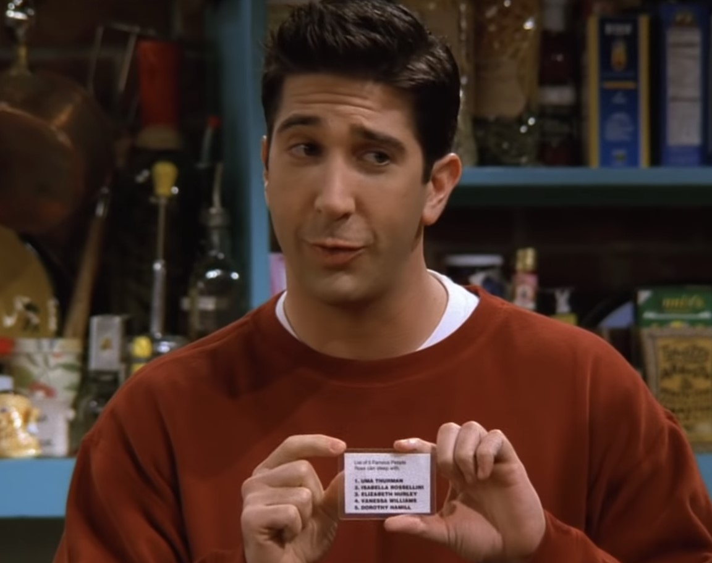
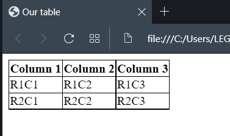
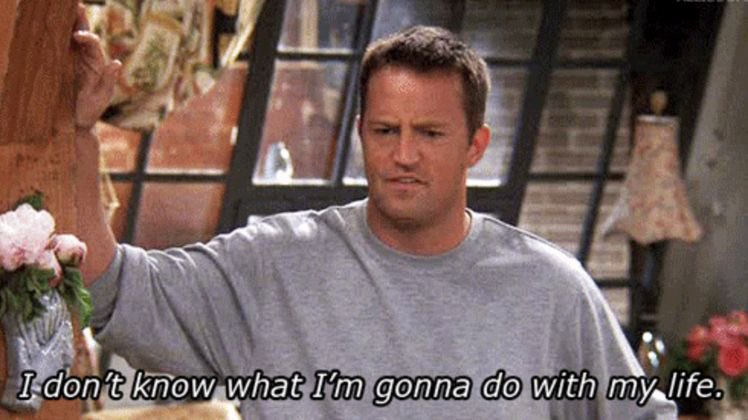
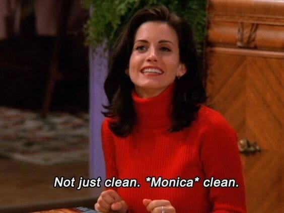
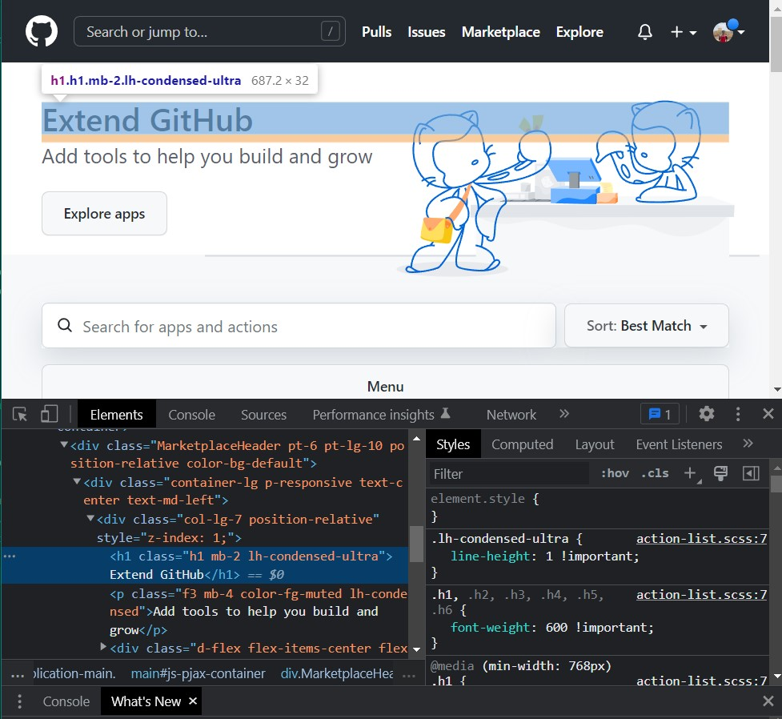
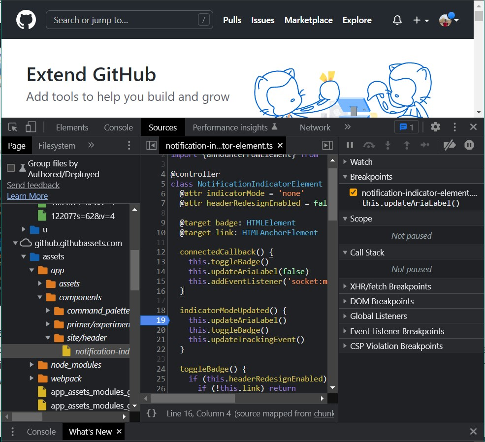

# Week 1: HTML & CSS
---
Welcome to the first session of ***ACM BITS Pilani Dubai's 2022 Coding BootCamp*** !! We hope this bootcamp will set a rock solid foundation to your journey in Computer Science!

This week, we'll be learning about HTML and CSS, and we'll cover these topics today.


- [X]  Intro to Web-Dev
- [x]  Languages (HTML/CSS/JS/SQL)
- [x]  Tags (h, p, b, div, span, etc.)
- [x]  HTML Tables
- [x]  Semantic HTML
- [x]  Intro to CSS
- [x]  Different methods to link CSS with HTML
- [x]  Selectors and Visual Rules
- [x]  "How to use Dev Tools?"
- [x]  Colors
- [x]  Position (absolute, relative, fixed)
- [x]  Typography
- [x]  Grid
- [x]  Flexbox
- [x]  Forms
- [x]  How to use DevTools?
---
## What is Web Development ?
Web development refers to the process of  building, creating, and maintaining websites. It can be divided in to two parts; 
-  **Front-end/Frontend**: 
  The front-end as the name suggests refers to the actual website that all the users will be able to see and interact with. A **front end developer** would would write code for the design, layout, colour schemes, animations, etc. of the website and make sure that it **looks beautiful and  modern**.

- **Back-end/Backend**:
  The back-end refers to the functions of the website which is not seen by the  users, for example,information retrieval from databases. 
  A developer that is responsible for writing code for both frontend and backend is called a Full Stack Developer.

The three main languages which you will encounter frequently in Web Development are: 
- **HTML**: The HyperText Markup Language or HTML is the standard markup language for documents designed to be displayed in a web browser.
- **CSS**: Cascading Style Sheets (CSS) is a style sheet language used for describing the presentation of a document written in a markup language such as HTML or XML.
- **JavaScript**: JavaScript often abbreviated JS is language is used to decide behaviour of a website (for e.g. what happens when you click a button). You will learn more about this in the JavaScript week of the Coding Bootcamp.

This week, we'll be focusing on the concepts of HTML and CSS. 
## What is HTML?
HTML stands for Hyper Text Markup Language, and it is the standard markup language for creating web pages. HTML describes the structure of a Web page, and consists of a series of elements (usually starting with `<html>` and ending with `</html>`). Elements tell the browser how to display the content
## HTML Tags
Elements are denoted as "tags" in HTML, starting with `<>`and ending with `</>` . There is a tag for every element of a web page.Let's look at a few of them: 
- #### `<html>`
  This is the HTML document tag, marks the start and end of HTML document. By convention, all other tags are included inside the `html` tag.
  `<html></html>`
- #### `<title>`
  This tag is used to decide what title will be display on the tab of the browser you are using.
  `<title></title>`
- #### `<body>`
  This tag encloses all the content inside the whitespace area or the area in which you can interact with the website.
  `<body> Some content </body> <!-- Body of a webpage -->`
- #### `<script>`
  You can write Javascript code here, this tag is usually inside `<body>` at the ending before `</body>`
  `<script></script>`

- #### `<p>`
  This tag is used for enclosing a paragraph in the webpage.
  `<p>Your paragraph</p> `
- #### `<h1>`
  This tag is used for headers/titles on the webpage, and the font size can be modified based on the tag as shown below.  
  ``` 
  <h1></h1>  
  <h2></h2> <h3></h3> <h4></h4> <!-- You can give smaller header text sizes also 1:biggest 6:smallest>
  ```
- #### `<br>`
  This tag is a new line tag, it does not require a closing tag 
  `<br>`
- #### ``
  This is an image tag, you can specify the path of the image by typing it inside `src=""`.
  ` </img> `
- #### `<audio>`
  This is an audio tag, if you want to play sounds on the webpage.  
  `<audio></audio> `
- #### `<div>`
  This is a very commonly used tag, basically if you want create box section.You can place other content inside and the size/colour and other properties can be changed using CSS.
    `<div></div> `
- #### `<a href="">`
  This is link tag which redirects to another website
  `<a href="someotherwebsite.com"> Click me pls :') </a>`
- #### `<form>`
  This tag is used for denoting forms (signup/login/other) 
  `<form></form>`
- #### `<input>`
  This tag is used to create an "input text" field (usually inside a form, or maybe a search bar)
  `<input></input> `
- #### `<button>`
  This tag is used to create a button
  `<button>Click Here!</button>`
- #### `<ul>`
  The `<ul>` tag stands for unordered list, the `<li>` element signifies a list item inside the UL.
  ```html
  <ul>          
    <li>List Item 1</li>  
    <li>List Item 2</li>
    ..
  </ul>
  ```
<centre></centre><br>
*Ross didn't know about HTML lists. Don't be like Ross.*


You can also access the entire list of HTML tags [here](https://www.w3schools.com/tags/default.asp).

## HTML Tables
You can also create tables in HTML using the `<table>` tag. For each row inside a table, you need to include a `<tr></tr>` tag, and for each column element inside a row, `<td>` tag is used. If you also want to add table header, then you can make another  Let's look at an example:
```html
    <body>
        <table >
            <tr> <th>Column 1</th> <th>Column 2</th> <th>Column 3</th>
            </tr>
            <tr> <td>R1C1</td> <td>R1C2</td> <td>R1C3</td>
            </tr>
            <tr> <td>R2C1</td> <td>R2C2</td> <td>R2C3</td>
            </tr>
        </table> 
        <!-- Here R1C1 means Row 1 column 1 -->   
        <!-- <table></table> is usually included inside <body></body> tag -->
    </body>
```
```html
<!-- P.S you would also need to paste this inside <head></head> for proper formatting -->
<style> 
	table, th, td {
 	 border: 1px solid black;
	  border-collapse: collapse;
	}

</style>
```

<br>

*Output of the above code*
## Semantic HTML
A semantic element in HTML clearly describes what it means to both the developer and the browser. Non-semantic elements such as `<div>` and `<span>` tell us nothing about its content from the name, however elements such as `<form>`, `<table>`, `<article>` clearly denote that they contain a form, table and article.<br>
<br>
For example in the above image, if we use the header/nav/footer tag at any location in the HTML file, then they would refer to that part of the webpage since the browser already knows by the tag name which location the content should go.<br>
<br>
*Unfortunately Chandler still doesn't know the semantics of his life*

## Intro to CSS

**Cascading Style Sheets**, fondly referred to as CSS, is a simply designed language intended to simplify the process of making web pages presentable. CSS allows you to apply styles to web pages. More importantly, CSS enables you to do this independent of the HTML that makes up each web page. It describes how a webpage should look: it prescribes colors, fonts, spacing, and much more. In short, you can make your website look however you want. CSS lets developers and designers define how it behaves, including how elements are positioned in the browser. 

Let's take a look at some syntax of CSS.
```CSS
h1{  /* Here, the h1 part is called selector since it selects only the h1 html tags and applies these properties.*/
    color:blue;
    size:12px;
    background-color:red;
/* The curly braces part is called the declaration.*/
}
```
## Different ways to link CSS with HTML
There are three ways to link a CSS file with HTML: 
- #### External CSS:
  When we talk of external CSS, we have our CSS stylesheet stored in a different file than the HTML file. 
  To use the CSS style sheet, each HTML page must include a reference to the external style sheet file inside the <link> element, inside the head section, for e.g.
  ```HTML
  <html>
      <head>
          <link rel="stylesheet" href="mystyle.css">
      </head>
      <body>

          <h1>This is a heading</h1>
          <p>This is a paragraph.</p>

      </body>
  </html>
  ```
- #### Internal CSS:
  An internal CSS stylesheet may be used if the design and colours of the stylesheet are unique to that specific HTML file, i.e it doesn't need to be shared among other HTML pages. The internal CSS is defined inside of the `<style>` tag, inside the `<head>` section. It is basically copying an entire css file and pasting inside `<style></style>` tags, for e.g.
  ```HTML
  <head>
  <style>
  body {
    background-color: linen;
  }

  h1 {
    color: maroon;
    margin-left: 40px;
  }
  </style>
  </head>
  ```
- #### Inline CSS:
  An inline CSS style is applied when we want to apply a unique style to a single element on a webpage. This can be done using the `style` property within a tag and specifying the properties in that.
  ```HTML
  <html>
  <body>

  <h1 style="color:blue;text-align:center;">This is a heading</h1>
  <p style="color:red;">This is a paragraph.</p>

  </body>
  </html>
  ```
## CSS Selectors and Visual rules
CSS selectors are used to "find" (or select) the HTML elements you want to style. There are a few ways in which you can use CSS selectors:
- **Simple selectors**: Using Simple Selectors you can select HTML elements based on their name, id or class. For e.g.
  ```CSS
  p {   /*Here, all <p> elements on the page will be center-aligned, with a red text color */
    text-align: center;
    color: red;
  }

  #para1 {
  /* The CSS rule below will be applied to the HTML element with id="para1"  */
  text-align: center;
    color: red;
  }
  .center {
  /*all HTML elements with class="center" will be red and center-aligned*/   
    text-align: center;
    color: red;
  }
  ```
    
- **Combinator selectors**: Using this method, you can select HTML elements based on a defined relationship between elements, for example child of an element, adjacent to an element, etc.

  Here are a few types of Combinator selector: 
  - **Descendant Selector**
  This snippet selects all `<p>` elements inside `<div>` elements 
    ```CSS
    div p {
      background-color: yellow;
    }
    ```
  - **Child Selector**
  This snippet selects all `<p>` elements that are children of a `<div>` element
    ```CSS
    div > p {
        background-color: yellow;
    }
    ```  
  - **Adjacent Sibling selector**
  Sibling elements must have the same parent element, and "adjacent" means "immediately following"
    The below rule selects the first `<p>` element that are placed immediately after `<div>` elements
    ```css
    div + p {
      background-color: yellow;
    }
    ```
  - **General Sibling Selector**
  The general sibling selector selects all elements that are next siblings of a specified element.
      The below rule selects all `<p>` elements that are next siblings of `<div>` elements 

    ```css
    div ~ p {   
          background-color: yellow;
        }
      ```  


Now moving on to **CSS Visual Rules**, these are basically the rules which we write inside the declaration part `{}` of the rules in a CSS Stylesheet. Let's look at some basic CSS rules to get started (there are many more than given in this snippet):

```css

/* Example syntax*/
p{
font-size: 30px;   
background-color: blue; 
width: 200px !important; 
opacity: 0.5;
background-image: url("../resources/nyancat.png"); 
}
```

## Colors
You can define colors as either RGB, HEX (hexadecimal), or HSL (Hue,Saturation, Lightness) values.
rgb(red, green, blue)
- **RGB Colors**:

  RGB colors can be defined in CSS like the following ` color: rgb(red, green, blue)`
  Each parameter (red, green, and blue) defines the intensity of the color between 0 and 255.


  For example, rgb(255, 0, 0) is displayed as red, because red is set to its highest value (255) and the others are set to 0.
  To display black, set all color parameters to 0, like this: rgb(0, 0, 0).
  To display white, set all color parameters to 255, like this: rgb(255, 255, 255).

  You can also have an additional parameter '**alpha**' which will decide the transparency/ opacity of the color, and it ranges from 0.0 to 1.0 `rgb(222, 100, 234, 0.5)`

  ```CSS
  color: rgb(255,0,0); /* Red */
  color: rgb(0, 0, 255); /* Blue */
  color: rgb(106, 90, 205); /* Indigo */
  color: rgb(106, 90, 205, 0.1); /* Indigo, more transparent */
  color: rgb(106, 90, 205, 0.7); /* Indigo, more opaque */
  ```
- **HEX colors**: 

  A **hexadecimal color** is specified with: `#RRGGBB`, where the RR (red), GG (green) and BB (blue) hexadecimal integers specify the components of the color.
  Each of fields of red, green, and blue can have value from 00 in hexadecimal (decimal 0) to FF in hexadecimal(decimal 255). Similar to the RGB colors, where (255,255,255) represents white, in hex #FFFFFF represents white.
  ```CSS
    background-color: #ffffff; /* Black */
    background-color : #000000; /* White */
    background-color: #00ff00; /* Green */
    background-color: #ff0000; /* Red */
    background-color: #0000ff; /* Blue */
  ```

- **HSL colors**: 

  A color can be specified using hue, saturation, and lightness (HSL) in the form:

  `hsl(hue, saturation, lightness)`

  **Hue** is a degree on the color wheel from 0 to 360. 0 is red, 120 is green, and 240 is blue.

  **Saturation** is a percentage value, 0% means a shade of gray, and 100% is the full color.

  **Lightness** is also a percentage, 0% is black, 50% is neither light or dark, 100% is white
  ```CSS
  color: hsl(0, 100%, 50%); /*Red */
  color: hsl(240, 100%, 50%); /*Blue */
  color: hsl(39, 100%, 50%); /* Golden */
  color: hsl(274.6, 100%, 25.5%); /* Indigo */
  ```
## CSS Positioning
CSS positioning refers to how an element is positioned in a document. The `top`, `right`, `bottom`, and `left` properties which refer to the distance in each respective direction from the window or other elements determine the final location of positioned elements. 
There are a few types of positioning in CSS:

- **Static Positioning**: 

  The element is positioned according to the normal flow of the document. The `top`, `right`, `bottom`, `left`, and `z-index` properties have no effect.This means that the element will appear in the same order as it is mentioned in the HTML document, and will take up the closest space availible.  This is the default value (***we usually need to change this***).

  ```CSS
  h1 {
    position: static;
  }
  ```
- **Relative Positioning**:

  The element is positioned according to the normal flow of the document, and then offset relative to it's position in a `static`(default position) based on the values of `top`, `right`, `bottom`, and `left`. The offset does not affect the position of any other elements; thus, the space given for the element in the page layout is the same as if position were `static`.


  ```CSS
  h1{
    position: static;
  }
  h2{
    position: relative;
    top: 40px;
    left: 40px;
  }
  h3{
    position: static;
  }
  /* Here, only the h2 element position will be changed by 40px downwards and  40 px right*/
  /* relative to its default position. The other elements are unaffected*/
  ```
- **Absolute Positioning**: 
  Using absolute positioning, an element is positioned relative to its parent container, if any, otherwise, it is placed relative to the screen (initial containing block). We can also use `position: fixed` to directly position the element w.r.t the screen (initial containing block)

  ```CSS
  .parentdiv{
    background-color: 'red';
  }
  h1{
    position: absolute;
    top: 40px;
    left: 40px;
  }
  /* Here, h1 is present inside a div with class name 'parentdiv'. */ 
  /*The h1 element is positioned with respect to the boundaries of the parentdiv and not its sibling elements. */
  ```
## CSS Typography
CSS typography relates to the style, spacing, and proportions of text on a website. Good typography can greatly improve a site's user experience, and the readability of the text. Good typography can allow users to grasp the meaning of the text quicker, and makes it more aesthetic. There are a few properties relating to typography in CSS:

- **Color**:

  You can set the color of text by using the `color` property. It can hold values of type RGB, RGBA, HSL or HEX values (*as discussed earlier*)

- **Font Family**: 

  You can use the `font-family` property to set which font the text will be using. You can also set multiple fonts to a text, so if the browser was not able to load the first font, then it will use the next font, and so on.

  ```CSS
  .text1 {
      font-family: "Source Sans Pro", "Arial", "sans-serif";
      /* The browser will use Arial if Source Sans is not availible, else sans-serif if Arial is not availible either */
  }
  /* sans-serif font. */
  .text2 {
      font-family: "sans-serif";
  }
  ```
- **Font Size**: 

  You can control the font size of your text using the `font-size` property. Here's an example of how to use `font-size`:


  ```CSS
  /* The text will use the browser's default medium size. */
  .text1 {
      font-size: medium;
  }
  ```
  `font size` can also have various units such as using pixel values:`font-size: 20px;`, You can use em values. `em` means that the value is relative to the parent's font-size :`    font-size: 1.2em;`, you can also use percentage:`font-size: 90%;`, relative keywords:`font-size: smaller;`, or absolute keywords like large, x-large, etc.`font-size: x-large;`

- **Font Weight**:
 
  You can choose the font weight by using the `font-weight` property. It can store values like `normal`,`bold`, or numerical values like `600`, `800`, etc.
  ```CSS
  .text1 {
      font-size: x-large;
      font-weight: normal;
  }
  /* BOLD text. */
  .text2 {
      font-size: x-large;
      font-weight: bold;
  }
  /* using a numerical value for the weight */
  .text3 {
      font-size: x-large;
      font-weight: 800;
  }
  ```

- **Font Style**: 
  You can choose the Italics of the text using the `font-style` property. It can store values like `normal`, `italic`, or `oblique`.

  ```CSS
  body {
    
  }
  .text1 {
      font-style: normal;
    /* font-style can also hold values "italic" and "oblique" */
  }

  ```

- **Text Align and Decoration**: 

  You can set the alignment of the text using `text-align` property, or underline/ strikethrough the text using `text-decoration` property .
  ```CSS
  .text1 {
      font-size: large;
      text-align: left;
      /* Text align can also hold values: right, center, justify */
  }
  .text5 {
      font-size: large;
      text-decoration: underline;
  }
  ```
## CSS Grids
The CSS Grid Layout Module offers a grid-based layout system, with rows and columns, making it easier to design web pages without having to use floats and positioning. The Grid layout consists of a parent `grid container` element and any number of child `grid items`. These grid items are placed inside the columns and rows of the grid container.

- **Grid Container**: 

  You can set any element as a grid container, but it must have the property of `display: grid;` or `display: inline-grid`. We use the `grid-template-columns` to set the number and width of the columns and similiarly `grid-template-rows` for rows.
  ```CSS
  .grid-container {
    display: grid;
    grid-template-columns: 80px 200px auto 40px;
    /* Represents 4 columns, with width of 80px,200px, auto and 40px.*/
    /* The width can be set to auto to make it evenly spaced*/
    grid-template-rows: 80px 200px;
  /* Represents 2 rows of 80px and 200px height. */
  }
  /* In this manner, we can define the dimensions of the grid. */
  ```

- **Grid Item**:

  A grid container contains grid items.
  By default, a container has one grid item for each column, in each row, but you can style the grid items so that they will span multiple columns and/or rows.
  Using the `grid-column` property on a grid item element, we specify which column the element will ***start*** and which column it will ***end***, and vice versa for the `grid-row` property. 

  ```CSS
  .item1 {
    grid-column: 1 / 5;
    /* Item starts on column  1 and ends before column 5. */
  }

  .item2 {
    grid-column: 1 / span 3;
    /* Make "item2" start on column 1 and span 3 columns */
  }
  .item3 {
    grid-column: 2 / span 3;
      /* Make "item3" start on column 2 and span 3 columns */
  }
  .item4 {
    grid-row: 1 / 4;
    /* Make "item4" start on row-line 1 and end on row-line 4 */
  }
  .item5 {
    grid-row: 1 / span 2;
  /* Make "item5" start on row 1 and span 2 rows*/
  }
  ```
## CSS Flexbox
CSS Flexbox (FLexible Layout) aims at providing a more efficient way to lay out, align and distribute space among items in a container even when the size is unknown or dynamically changing. The flexbox design consists of two parts: A parent **flexbox container**, and the **flexbox items** inside the parent container. There are various properties for both flexbox container and flexbox items, which can be customised as per user needs. 

- **Flexbox Container**:

  The flexbox container is the parent element which will hold the inner flexbox items. Any HTML element can be set as a flexbox container by setting `display:flex;` inside the CSS class rules. 
  The properties for flex container are :

    - **`flex-direction`**:
    The `flex-direction` property defines in which direction the container wants to stack the flex items.
    ```css
        .flex-container {
      display: flex;
      flex-direction: column;
      /* The column value stacks the flex items vertically (from top to bottom)*/
    /* flex-direction can hold values "column", "column-reverse", "row", "row-reverse" */
    }
    ```
    - **`flex-wrap`**
    The `flex-wrap` property specifies whether the flex items should wrap or not. 
    ```css
     .flex-container {
      display: flex;
      flex-wrap: wrap;
    }
    ```
    - **`flex-flow`**
    The `flex-flow` property is a shorthand property for setting both the flex-direction and flex-wrap properties.
    ```css
        .flex-container {
      display: flex;
      flex-flow: row wrap;
    }
    ```
    - **`justify-content`**
    The `justify-content` property is used to align the flex items 
    The center value aligns the flex items at the center of the container. It can also have values flex-start and flex end for left and right alignn respectively.
    ```css
     .flex-container {
      display: flex;
      justify-content: center;
    }
    ```

    - **`align-items`**
    The `align-items` property is used to align the flex items (vertically i.e top-bottom).It can have values flex-start, flex-end, stretch, or center.
    ```css
      .flex-container {
      display: flex;
      height: 200px;
      align-items: center;
    }
    ```
- **Flexbox Items**
  The child divs inside a div assigned as flex container become the flexbox items. We can change the way flexbox items behave or are arranged inside a flexbox container by changing properties such as 
  - **`align-self`**
  Specifies the alignment for a flex item (overrides the flex container's align-items property)
  ```html
   <div class="flex-container">
    <div>1</div>
    <div>2</div>
    <div style="align-self: center">3</div>  /*This div is aligned vertically in the center */
    <div>4</div>
  </div>
  ```
  - **`order`**  
  The order property specifies the order of the flex items.You can arrange the items in any order by setting the order property.
  ```html
   <div class="flex-container">
    <div style="order: 3">1</div>
    <div style="order: 2">2</div>
    <div style="order: 4">3</div>
    <div style="order: 1">4</div>
  </div>
  ```
  - **`flex-grow`**
  The flex-grow property specifies how much a flex item will grow relative to the rest of the flex items.
  ```html
  <div class="flex-container">
    <div style="flex-grow: 1">1</div>
    <div style="flex-grow: 1">2</div>
    <div style="flex-grow: 8">3</div>  /*Makes the third flex item grow eight times faster than the other flex items*/
  </div>
  ```
  - **`flex-shrink`**
   Similiarly, we can use the `flex-shrink` property to set how fast an item will shrink w.r.t. other items.
  If it is set to 0, an item will not shrink
  
  - **`flex-basis`**
  The flex-basis property specifies the initial length of a flex item.
  ```html
    <div class="flex-container">
    <div>1</div>
    <div>2</div>
    <div style="flex-basis: 200px">3</div>
    <div>4</div>
  </div>
  ```
  - **`flex`**
  The flex property is a shorthand property for the flex-grow, flex-shrink, and flex-basis properties.
  ```html
  <div class="flex-container">
    <div>1</div>
    <div>2</div>
    /* Make the third flex item not growable (0), not shrinkable (0), and with an initial length of 200 pixels */
    <div style="flex: 0 0 200px">3</div>
    <div>4</div>
  </div>
  ```
Using CSS proficiently will give you a **modern**, **beautiful** and **clean** website design.
<br>
<br>


## **How to use DevTools**
Browser Developer tools is a menu option on your browser which can be used for inspection, debugging, or making minor changes in the code. There is also a console which can be referred to for error outputs (if any). Let's look at how to use it.

- **How to open it?**
  You can open it by pressing `Ctrl+Shift+I` on Windows, or `⌘ + ⌥ + I
  ` on MacOS. You can also right click on any part of a webpage and choose `Inspect` to open Devtools.
- **DOM Inspector**
  The developer tools usually open by default to the inspector, which looks something like the following screenshot. This tool shows what the HTML on your page looks like at runtime, as well as what CSS is applied to each element on the page. It also allows you to instantly modify the HTML and CSS and see the results of your changes reflected live in the browser viewport. You can modify HTML on the left pane, and CSS on the right side `styles` pane. The target element is highlighted (as shown below).
  <br><br>
  On top of the right CSS pane you also see a few other tabs.
  - **Computed** : This shows the computed styles for the currently selected element (the final, normalized values that the browser applies). It also has a `box model` which represents visually the current element's box model, so you can see at a glance what padding, border and margin is applied to it, and how big its content is. You can also see the Fonts tab which shows the fonts applied to the current element.

  - **Layout**:
  If the page you are inspecting uses CSS Grid, this section allows you to view the grid details.
- **Sources/Debugger**:
  The JavaScript debugger allows you to watch the value of variables and set breakpoints, places in your code that you want to pause execution and identify the problems that prevent your code from executing properly.
  <br><br>
  You can set a breakpoint by clicking on the line number (for example a breakpoint has been set by clicking on 19 in the above image.)
  Once the breakpoint is set, the code executes and pauses at a breakpoint, and you can check the values of various variables at that line, and then restart the execution.
- **Console**: 
  The JavaScript console is an incredibly useful tool for debugging JavaScript that isn't working as expected. It allows you to run lines of JavaScript against the page currently loaded in the browser, and reports the errors encountered as the browser tries to execute your code. You can also `console.log()` any variable values or messages that you want to check in your code, and they will appear here.
  <br><br>


