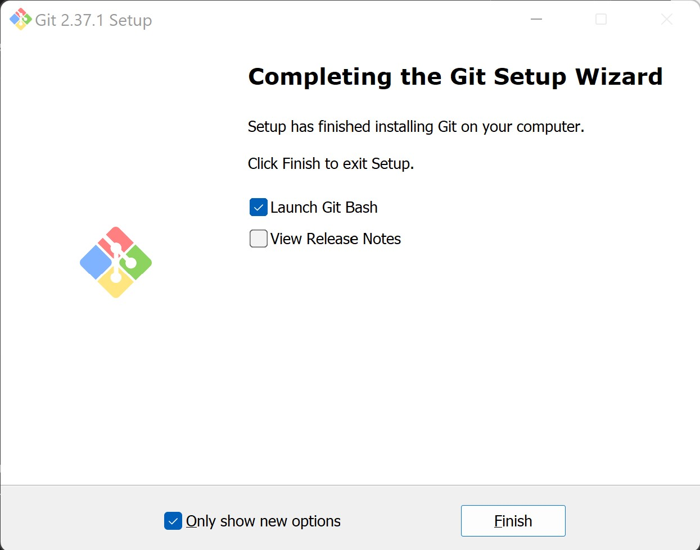

# The Crash Course for your Command Line (and Git)

A command-line interface (CLI) is a text-based interface used to run programs, manage computer files and interact with your computer. Most operating systems (OSes) also offer a graphical user interface (GUI) which is usually easier to learn.

## So Why CLI's?

Fluency on the command line is a skill which improves your productivity and flexibility as a computer engineer:

*   **Functionality**
    A GUI does not have the same level of functionality and control as a CLI. CLI's can be used to easily do things that are difficult or even impossible to do with a GUI.

*   **Automation**
    With a CLI, users have all the control over the file system and operating system, and the tasks become simple. You can create a script that contains a few lines of command and it will do the work for you.

*   **Programming**
    The CLI is extremely helpful for programmers for: Installing modules, debugging code, setting up softwares like Git, NPM, Pip, MySQL etc.

*   **Speed & Memory**
    CLI's are faster and use lesser memory. They can even be used to salvage an older laptop that's too slow to run a GUI.

Another great thing about CLI's is that you look really cool working with it... In fact you might even feel - Legendary.

<div align='center'>
  
</div>

---

## Getting Connected

### **Windows**

We are going to be using a pretty nifty tool called `Git Bash`. `Git Bash` is an application for Microsoft Windows environments which provides an emulation layer for a command line experience. 

*What Does that mean?* It means you can experience a *Linux*-like terminal within your windows PC. Git Bash comes included with Git itself, so just download Git from:

[GIT DOWNLOAD LINK FOR WINDOWS](https://git-scm.com/download/win)

If you don't know if you're a 32 or 64 bit system check *settings > system > about* (might vary depending on Windows version)

**STEPS:**
* Once the `.exe` file is saved in your PC, run it.
* Click on **Yes** when promted to allow this application to make changes to your PC
* Read the Terms & Conditions *(yeah right)*. Click on **Next**.
* For the next few screen feel free to just keep clicking **Next** if you don't know what anything means.
* Once Installation is done, you will see a screen like this
<div align='center'>
  
</div>

* Check the `Launch Git Bash` Option. There you go, setup completed. You should now have a terminal screen launched.

### **Mac**

TODO (Mostly no installation needed?)

### **Linux Distros**

Linux? Great, simply launch a new terminal by either pressing `Ctrl+Alt+T` or right click the desktop and Open Terminal.

---

## Let's Begin

### **Simple Stuff**

#### `printf`

The `printf` command is used to print output on screen. It can also be used to print in a specific format. This is similar to the printf command from the C language.

```bash
printf "Hello, %s\n" "World"
```

> #### **Windows Git Bash Users**
> You might find pasting stuff to Git Bash isn't as simple as `Ctrl+V`. If you right click on the terminal you will see that paste is `Shift+Insert`. You can go into *Options>Keys>Ctrl+Shift+Letter Shortcuts* to enable `Ctrl+Shift+V` for pasting.

#### `echo`

Echo is another command which can be used for displaying/printing whatever follows to the standard output (screen).

```bash
echo "Hello, world."
```

#### **Comments**

```bash
Anything to the right of the # is ignored by the command line interface.
```
They are there just for you. So you know what you're doing.

---

### **Navigation**

When working with a GUI, we navigate across the filesystem using a file explorer:

*   File Explorer (Windows)
*   Finder (macOS)
*   Dolphin, Nautilus, Thunar and many others! (Linux)

Akin to those, CLI's use paths to refer to files and to let you know where you are. The *path* of a file or a directory describes their location on a computer.

#### Path

The *path* of a file or a directory describes their location on a computer.

There are two types of paths:
- **Relative Path**: It refers to the location of a file or directory, *relative* to the *current* directory (or *present working directory/pwd*). The paths can look something like `stolen/bluehorn.txt` (no '`/`' in the start)
- **Absolute Path**: It is the location of a file or a directory, *relative* to the *root* directory. These will look something like `/c/Users/TedMosby`. The main difference in how the system recognises Relative and Absolute paths are the leading '`/`' in absolute paths.

Some important shorthand notations:
- `.` refers to the *current* directory
- `..` refers to the *parent* of the *current* directory
- `~` refers to the `HOME` directory
- `/` refers to the *root* directory

> #### **Case Sensitivty**
> Since `Git Bash` resides in a Windows Machine, it is not case sensitive, so you can refer to your location as /c/Users/Ted or /c/users/ted and both will work. This is not the case in a traditional linux distro where directories and files are case sensitive.

#### `pwd`

Use the `pwd` command to find the present working directory.

```bash
pwd # this will tell you exactly where you are (absolute path)
```

#### `ls`

The `ls` command is used to list all the files and directories. You may even type `ls {path} # relative or absolute` to list files from a specific path, by default it lists files from your present working directory.

```bash
ls # Simply prints all files and directories, which may even be colour coded depending on the client you are using

ls Desktop/ # Prints all files and directories within /pwd/Desktop (relative path)

ls /c/Users/{your_username}/Desktop # Prints all files and directories within /c/Users/{your_username}/Desktop, same as previous command but using an absolute path
```

This command is used to list out all files and directories along with hidden files and links to parent directories. Hidden directories/files are represented by a '.' before the filename, such as *.bashrc*

```bash
ls -a # The -a is known as a command line option, a single command can have multiple options
```

> #### **Command Line Options in Bash**
> Almost all command such as `pwd`, `ls` come with Command line options. These options are recognised by a minus sign for example `ls -a`. 
>
> You can see all command line options for a certain command by using the command `man`

#### `man`

The `man` command displays the user manual entry for the command mentioned.

*Unfortunately the `man` command is not supported with `Git Bash`, alternatively most commands come with a command line option --help, or you can refer the [Resources](#cool-stuff-1) for a help sheet.*

```bash
man ls # this will bring up a screen with the manual entry, use your ↓ arrow key to scroll, and press q to go back to your CLI
ls --help # for Git Bash users
```

#### `clear`

Terminal is getting messy? `clear` the output simply by using:

```bash
clear
```

You may also use `Ctrl+L` for *similar* functionality.

#### `cd`

The `cd` is used for traversal between directories.

Once you have used the `ls` command and you see the existing directories, you can cd/change directory into them using this command

```bash
cd Directory_name
```

If the directory we wish to explore is nested we use
```bash
cd Documents/CodingBootcamp
```
It can only be used to enter directories not files.

The `cd` command is also use to traverse up directories, we do this by typing, as mentioned in the [path](#path) section above.
```bash
cd ..
```
which moves up a directory.

To return to the home directory you can simply
```bash
cd
```

remember you can always check where you are by typing `pwd`.

> #### **Quick Tricks**
> One great way to make your CLI workflow faster is by using some keyboard shortcuts. Use the ↑, ↓ arrows on your keyboard to recall the commands you have typed in previously
>
> *Tab button*, once you type `cd` and begin typing in a directory name, `cd maind` you can press *tab* to autofill the rest of the name, of course this would only work if the first few letters of the directory existed. 


---

### **Let's get Creating**

#### `mkdir`

The `mkdir` command is used to create a *directory*. So let's make one, ensure you are at your *home directory*, use `cd` to get there.

```bash
mkdir TedMosby # Makes a directory called TedMosby
```

To see that it has been created use `ls`, then `cd` into your newly created directory with 

```bash
cd TedMosby
```

#### `touch`

Use the `touch` command to create a file, if the file already exists, touch will just update timestamps.

```bash
touch teds_friends.txt # creates an empty file named 'teds_friends.txt'
```

Most systems have in-built text editors.
[Vim](https://www.vim.org/) (the sequel to [Vi](https://en.wikipedia.org/wiki/Vi)) and [Emacs](https://www.gnu.org/software/emacs/) are the best to use.
However, due to their *steep learning curves*, they are *not advisable for beginners*.

#### `stat`

The `stat` command is similar to properties of a file in windows.
```bash
stat teds_friends.txt
```

#### `nano`

Let's start editing files, for that we will use a simple command line text editor known as `nano`.

```bash
nano teds_friends.txt # opens 'teds_friends.txt' with nano
```

Let's keep track of Ted's best friends with this file.

```
Marshall Eriksen
Robin Scherbatsky
Barney Stinson
Lily Aldrin
```

To save the contents of the file:

*   Hit `Ctrl` + `S` to save the contents of the file.
*   Hit `Ctrl` + `X` to exit `nano`.

---

### **Reading Files**

#### `cat`

Use the `cat` command to display the contents of the file

```bash
cat teds_friends.txt # This will print the text you entered in the previous step 
```

#### `head`

Use the `head` command to display the first few lines of the file

```bash
head teds_friends.txt -n 2 # prints the first 2 lines, change the number to print a different number of lines, if you dont specify -n option it will print 10 lines by default
```

#### `tail`

Similarly, you can display the last few lines with `tail`

```bash
tail teds_friends.txt -n 2
```
#### `less`

When it comes to larger files, it becomes inconvenient to just print the entire file to your terminal, so the `less` command comes in handy, it generates a page layout.

```bash
less teds_friends.txt # You can use arrow keys to scroll, and type q to quit
```
---
### **Task Time**

Create files with the following content using `nano`:

> #### **Files/Directories with Spaces**
> Making files with spaces is slightly different, all you need to do is
> ```bash
> nano 'Marshall Eriksen.txt' # The Quotes allow you to use spaces in the filename
> ```
>You can even use double quotes, or the escape character for spaces such as `nano Marshall\ Eriksen.txt`

Now getting back to making these files, and recording Ted's friends birthdays!

<div align='center'>
  
</div>

*   `Marshall Eriksen.txt`
    ```
    1978
    ```

*   `Robin Scherbatsky.txt`
    ```
    1980
    ```

*   `Barney Stinson.txt`
    ```
    1976
    ```

*   `Lily Aldrin.txt`
    ```
    1978
    ```

Now `ls` should show you:

```bash
ls
'Barney Stinson.txt'  'Marshall Eriksen.txt'    teds_friends.txt
'Lily Aldrin.txt'     'Robin Scherbatsky.txt'
```
The workspace is very messy. Let us use directories to organize our files

Create 2 new directories:

*   `married`
*   `single`

#### `mv`

We can move files into specific directories using the `mv` command

Try the following commands to move `Marshall Eriksen.txt` and `Lily Aldrin.txt` into `married`:

*   ```bash
    mv "Marshall Eriksen.txt" married/ # 'Marshall Eriksen.txt' is moved into the directory 'married'
    ```

*   ```bash
    mv "Lily Aldrin.txt" "married/Lily Aldrin.txt" # renames 'Lily Aldrin.txt' as 'married/Lily Aldrin.txt' and hence moves it into 'married'
    ```
The `mv` command works the same as *cut and paste* functionality.

#### `cp`

We can create copies of files using the `cp` command, some might prefer combining `cp` and `rm` over using `mv` since it gives you a chance to double check.

```bash
cp 'Barney Stinson.txt' 'single/Barney Stinson.txt' # makes a copy of 'Barney Stinson.txt' and pastes it into single/Barney Stinson.txt
```

Do the same for `Robin Scherbatsky.txt`

#### `tree`

At this point `ls` can get confusing, to better visualize the contents of `PWD` use the `tree` command.

*Unfortunately `tree` doesn't work on `Git Bash` so you can use `ls -R` instead or even access the windows alternative with `tree.com //F`.*

```bash
tree # displays the names of files and directories in the PWD in a recursive manner
.
├── Barney Stinson.txt
├── Robin Scherbatsky.txt
├── married
│   ├── Lily Aldrin.txt
│   └── Marshall Eriksen.txt
├── single
│   ├── Barney Stinson.txt
│   └── Robin Scherbatsky.txt
└── teds_friends.txt

tree.com //F # *what is this?* tree is a windows command, by using the .com we are accessing windows commands from within git bash, the //F is a command option, just like how linux uses -f, -h etc, windows uses /F, /H etc.
C:.
▒   teds_friends.txt
▒
+---married
▒       Lily Aldrin.txt
▒       Marshall Eriksen.txt
▒
+---single
        Barney Stinson.txt
        Robin Scherbatsky.txt

```
If you've done everything right till this point, you will see this as the output.

#### `rm`

We made copies of `Barney Stinson.txt` and `Robin Scherbatsky.txt`, so now let's delete the originals with a simple, yet **permanent** command.

Use the `rm` command to delete files

```bash
rm 'Barney Stinson.txt'
```

```bash
rm 'Robin Scherbatsky.txt'
```

Run `tree` / `ls -R` / `tree.com //F` again to see what your `pwd` now looks like.

Now let's make a folder for saving the names of all of Ted Mosby's dates called `dates`
```bash
mkdir dates
```

#### `rmdir`

Who are we kidding, Ted went on like a 100 different dates, let's just *delete the folder*.

<div align='center'>
  
</div>
Poor Ted :(

Use the `rmdir` command to delete directories.

```bash
rmdir dates
```

If the directory had files in them you could use rm -rf to recursively delete the files and then the directory itself, using the below command.


```bash
rm -rf dates # -r specifies recursion, -f specifies force. Deletes a directory recursively
```

Be careful while using this command as a few mistypes and you might end up accidentally deleting every single file from the system!

---

### **Cool Stuff**

Remember when we said CLI's can do stuff GUI's easily cannot, well now that we covered the basics, let's look at some of the possibilities.

#### `wc`

The `wc` command or the word count command is used, as its name suggests, to get the counts. It can be used to get the number of lines, word counts, byte/character count.

Try
```bash
wc teds_friends.txt
4  8 62 teds_friends.txt
```

So what do these numbers mean?
*   4 - Number of lines

*   8 - Number of Words

*   62 - Number of Characters (includes spaces and newlines)

**Options**:

Adding the `-l` option, gives you only the number of lines in the file. Adding the `-w` option, gives you only the number of words in the file. Adding the `-c` option, gives you only the number of characters in the file.

Feel free to use the `man` command to see more about the command options
```bash
man wc
```
*or for `Git Bash` users*
```bash
man wc --help
```

#### `grep`

`grep` command is used to search for a specific string in a given file. `GREP` stands for   *Global Regular Expression Print*. It has a simple syntax given by:

```bash
grep string_to_search file_to_search_from
```
So let's try it

```bash
grep Lil teds_friends.txt
Lily Aldrin
```
This finds the phrase Lil in the file, and prints the line it was in.

#### **Variables**

The Linux command line can even have variables, variables are used to store any sort of information, and they can be referenced later.

**Example:**
```bash
temp_variable="hello world"
```

Now there is a **local** variable called temp_variable saved in this session, make sure there are no spaces before or after the `=` sign.

*Referencing the created variable*
```bash
echo $temp_variable
```

The `$` is used to reference this variable in the terminal. But the functionality of the `$` doesn't end here.

**Command Substitution**

Here's another cool thing you can do with this concept
```bash
echo "The output of the wc command is $(wc teds_friends.txt)"
The output of the wc command is  4  8 62 teds_friends.txt
```

As you can see, by using $(command) this allows you to combine commands easily, you might find use for this in combination with mathemathical commands such as `expr` and more.


#### **Piping**

Piping can be very useful and it allows you to do more complex tasks.

Piping commands enables the output of one command to be used as the input for another.

*Syntax*:
```bash
command_1 | command_2 | command_3 | .... | command_N
```

**Example:**
```bash
echo "Ted Mosby" | wc
      1       2      10
```
So what just happened?

The output of `echo "Ted Mosby"` is sent to `wc`, so wc then outputs 1 line, 2 words, 10 characters (including the newline).

Let's do something slightly more complex to understand piping better.
**Example:**
```bash
printf "Ted Mosby\nAnd Friends" | grep Friends | wc
      1       2      12
```
So again, what just happened?

`printf` outputs
```
Ted Mosby
And Friends
```
then `grep Friends` searches that string and outputs
```
And Friends
```
Now this is passed to `wc` which of course prints the final output that is, 1 line, 2 words, and 12 characters. Pretty nifty right!

#### **Output Redirection**
 
The symbols used for output redirection are `>` and `>>`. Output redirection allows you to save the output of a certain command into a file instead of just printing it to terminal and losing it forever.

**Example:**
```bash
echo "Ted Mosby" > tempfile.txt # Writes "Ted Mosby" to new file called tempfile.txt, or replaces content if the file already exists
```

And now you can use `ls` to see a new file, and `cat` to see what just happened.

```bash
cat tempfile.txt
Ted Mosby
``` 

Let's also explore the `>>` symbol

```bash
echo "the architect" >> tempfile.txt # Adds to existing file called tempfile.txt or creates file if it doesn't exist
```
Now if you `cat tempfile.txt` you will see
```bash
Ted Mosby
the architect
```

---

### **Commands Galore!**

Let's just see a few more commands, of course there are so much more, but that's what Google is for!

<br>

#### `history`

Use the `history` command to show your command history

```bash
history
```

You can combine `grep` and `history` to search for a particular command

```
history | grep "cd"
```

#### `expr`

Use the `expr` command to do simple math or comparisions

```bash
expr 1 + 1  # ensure correct spacing
2
```

#### `whoami`
It displays the username of the current user when this command is invoked

```bash
whoami
```

#### `sudo`
Sudo stands for SuperUser DO and is used to access restricted files and operations

*This is command does not work with `Git Bash`. It is recommended not to use `sudo` anywhere unless you really know what you are doing.*

```bash
sudo command
```
Replace command with the command you wish to use

---
<br>

## Git - Version Control

Now that you are *somewhat fluent* in CLI's. Let's learn about Git, Git isn't restricted to Linux though, you can set it up on your windows machine too and use the same commands that you'll learn below. If you used `Git Bash` for the earlier section, your setup is already done!

**What is Version Control?**

Version control system (VCS) is a software tool that helps the developers keep track of every modification to the code. If a mistake is made and things break down, developers can go back and compare earlier versions to debug and help fix the problem.

**Why use Version Control?**

Version control allow ease of collaboration  with other developers with different teams working on different features. Besides that, developing software without using version control is risky, like not having backups.

**What is Git?**

Git is a version control system created by Linus Torvalds in 2005 for development of the Linux kernel. Git is distributed, every directory on every computer has a working copy of the code with a complete history of changes and full version tracking capabilities. 

**Why use Git?**

Git is the best choice for developers. Here are the main reasons why:

*	Git is **fast** in terms of performance using highly efficient algorithms to track all changes.
*	Git is **secure** with all files, directories, versions, commits and tags secured with a cryptographically secure hashing algorithm called SHA1.
*	Git is **flexible** with developers requiring no network access, when ready they can `push` their changes with one command.
*	Git is **free** and an open-source project with thousands of developers maintaining it.
*	Git is the factory **standard**, it is by far the most widely used version control system today.

And finally Git can help keep your work safe, so you won't lose valuable checkpoints of your progress, it can also create a habit of saving, so that hopefully you don't end up like Barney Stinson here!
<div align='center'>
  
</div>

---

## Installation

First check that you don't already have git installed

Try the following command:

```bash
git --version
```

If you don't have git installed you will see

```
command not found: git
```

---

So Follow the instructions on [this](https://git-scm.com/downloads) page to install `git`.

Try the following command:

```bash
git --version
```

If the installation is successful, you should see the version of the installed software.

```
git version 2.23.0
```

If something went wrong, you would see the following message instead:

```
command not found: git
```

---

## Configuration

#### `config`

To use `git` properly, you must set your name and email.

Use the `config` subcommand for this purpose.

```bash
git config --global user.name "[full name]"
git config --global user.email "[email address]"
```

To check the values with `config`

```bash
git config --list
```

Since we used the `--global` flag with our `config`, the same name and email will be used for any `git` repo we have on our system.

If you want to use a different name and email for a particular repo, use the `--local` flag instead

```bash
git config --local user.name "[full name]"
git config --local user.email "[email address]"
```

---

## Getting Started with Version Control

Create a directory anywhere

```bash
mkdir himym
cd himym
```

#### `init`

To initialize the repository, use the `init` subcommand.

```bash
git init
```

>   #### Repository
>   
>   A repository is a directory that has elevated functionality.

You have now created a `git` repository on your local system. If you list all files.

```bash
ls -la
```
This command is only for unix shells, or windows powershell. For windows cmd, you can use your file explorer and check the show hidden items option.

You should see a **.git** directory. 

> #### `.git/`
>
> The .git directory contains everything that's related to our repository. If you send a .git directory to someone else, they would have the complete git project and it's full history. 
>
> If you ever want to stop tracking your project using git, you can just delete the .git directory.

### Logical Areas of a Git Repository

Git uses 3 logical areas to provide version control:

*	**Working Tree**

	Also called the working directory, this is what we see in our file system. When we add, delete, and edit files, we do that in the working tree.

*	**Staging Area (Index)**

	The staging area is where you prepare the set of changes you want to add to your repository. It is the set of files that git will keep ready for a commit. This area allows us to have full control over the files we put into our next commit. If we have multiple files, only the changes in the staging area are put into the next commit.

*	**Repository**

	This contains the commit history which allows us to access the previous versions of our project. The history is stored in the .git directory.

Create a file called `README.md`

```bash
touch README.md
```
In windows you can simply use a text editor of your choice.

> A **README** file contains information about your repository, directories and files. It is a form of documentation which is a guide to developers giving a description about your project and instructions on how to run the code. The `.md` stands for **m**ark**d**own file. Markdown is a markup language which is easy to use for formatting text.

With your preferred text editor, add the following content to the `README.md`

```
# My First Repo

Hello, world!
```

#### `status`

Use the `status` subcommand

```bash
git status
```

You will be provided with the following information.

```bash
On branch master

No commits yet

Untracked files:
  (use "git add <file>..." to include in what will be committed)

	README.md

nothing added to commit but untracked files present (use "git add" to track)
```

>   #### Branches
>   
>   Git can track file changes across multiple braches/versions of a repository.
>   Each branch is its own universe. Git allows you to create branches from existing ones and move across them.
>	The default branch is called `master`.

>   #### Commits
>   
>   A commit is nothing but a checkpoint.
>
>	The `commit` command takes the staged changes and commits it to the project history.
>
>	When making commits use a clear and concise message describing the changes you have made.

`git` assigns `README.md` as _Untracked_ since it's a new file.
It will start tracking the file once we add it to the staging area.


In order to `commit` something, `git` needs to know exactly what to `commit`. In our case we want `git` to save the new file that we created, i.e. `README.md`. 

#### `add`

First let us add `README.md` to the staging area with the `add` subcommand

```bash
git add README.md
```
You can alternatively use `git add .` when there are a lot of files and you wish to add all of them into your repo.

Check the `status` of the repository

```bash
git status
On branch master

No commits yet

Changes to be committed:
  (use "git rm --cached <file>..." to unstage)

	new file:   README.md
```

Earlier, our file was untracked. `git` has now added the file into the staging area, it expresses this by putting the `README.md` in _Changes to be committed_. After adding it to the staging area, `git` realizes that we are planning to commit this file.

#### `commit`

Confirm the changes with `commit` and a message by using the `-m` flag

```bash
git commit -m "Intial Commit" # the -m flag is for a message. A message usually describes what the commit has done.
```

Checking the status again

```bash
git status
On branch master
nothing to commit, working tree clean
```

_Nothing to commit_ means everything in the staging area has already been committed.

_Working tree clean_ means there is nothing new in our directory.

#### `log`

We can `log` the `commit` history

```bash
git log	# shows the most recent commit at the top
```
<!-- Feel free to remove this -->
You can notice the following:

*	40 hexadecimal character hash
*	Author name and email
*	Timestamp
*	The message we provided

Try to use the `-p` flag with `log`

```bash
git log -p	# shows what changed with each commit
```

`branch`

Earlier we mentioned the master branch, we can even make branches of our own.

**Q) But why branches?**

<div align='center'>
  
</div>


It's always a good idea to make a new branch if you're planning on making any big changes and you want to keep the older versions alive. You don't want to be like Marshall here and make an irreversible mistake, commits and branches all make it easier for you to *get your hair* or your code back.

To make a new branch all you need to do is
```bash
git branch haircut
```

`checkout`

Now that you have a new branch called `haircut`, before you can commit changes to it, you should check it out with a simple command called `checkout`.

```bash
git checkout haircut
```

And now you just moved from branch `master` to branch `haircut`. You can make any changes you want to the `README.md` file now and commit them to this branch.

```bash
echo "I CUT MY HAIR" >> README.md
cat README.md
# My First Repo

Hello, World!
I CUT MY HAIR
```
Now let's commit to branch `haircut`, since we already used `checkout` all we need to do is
```bash
git add README.md
git commit -m "Haircut commit"
```

Remeber anytime you want to return to the `master` branch *(and get your hair back)*, all you will need to do is.

```bash
git checkout master # Return to master branch
cat README.md
# My First Repo

Hello, World!
```

See thanks to `Git` we can get our hair back just like that.

You can switch between branches using `git checkout` at any time and the files will be updated to when you last commited in said branch.

<br>

Congrats you just learned CLI + Simple Local Version Control.

---

## Challenge Time

<div align='center'>
  
</div>


* Earlier today we made a folder `TedMosby`, make sure you are in that folder. 
  <details><summary>Hint</summary><pre>
  Use `pwd` to check, `cd` to navigate
  </pre></details>
* Ted drank waaay too much last night, he can't even remember how many friends he has, using the files at your disposal, can you tell him? 
  <details><summary>Hint</summary><pre>
  Think about the `wc` command and it's options in relation to the `teds_friends.txt` file
  </pre></details>
* Ted has a date tonight, the girl is way out of his league, but it worked out since Ted promised to bring a double date, can you tell him the names of his single friends. 
  <details><summary>Hint</summary><pre>
  For starters try the 'ls' command, but here's the tricky part, want to get rid of the .txt at the end of the file name, Google can be your friend. See the awk command. You will need to use piping for this.
  <br>If you're sure you can't figure out the answer >
    <details><summary>Final Answer</summary><pre>
  ls single | awk '{gsub(".txt","");print}'
    </pre></details>
  </pre></details>
* Well that didn't go well, but Barney seemed to have *fun*, as usual, we need to put him in his place, can you calculate his age, so we can remind him to stop acting like a child :D
  <details><summary>Hint</summary><pre>
  Use command substitution with a math command such as `expr`
    <details><summary>Final Answer</summary><pre>
  echo "Barney's Age $(expr 2022 - $(cat "single/Barney Stinson.txt"))"
    </pre></details>
  </pre></details>
* Alright time to make some changes, but before we do remember version control, can you make the `TedMosby` folder into a git repo and commit all the files in it, don't forget to put a simple message with the commit.
  <details><summary>Hint</summary><pre>
    This one is simple, just to test what you know about git. Ensure you are in the `TedMosby` folder before executing the following.
    <details><summary>Answer</summary><pre>
    git init
    git status # will show you the status of the files in the repo
    git add . # will add all directories and files
    git commit -m "First Commit"  
    git log # will shows you your commit status
    </pre></details>
  </pre></details>
* Ted's fighting with Lily and Marshall, it's time to cut them out, but just in case they stop fighting, lets make a new branch called `fight` (`git branch`, `checkout`), delete the `married` folder and it's files, and also edit the `teds_friends.txt` file to cut out Marshall Eriksen and Lily Aldrin.
  <details><summary>Hint</summary><pre>
  Use `git branch fight` to make a new branch `fight` and `git checkout fight` to get onto the newly created branch `fight`.

  Use rm -rf for deleting the folder `married`, and use nano to edit `teds_friends.txt`
  </pre></details>
* Commit the new changes to the new branch `fight`, let the message be "In a fight!". Don't forget to `git add` and check if it worked with `git log`.
* Good news, Ted's made up with his friends, um but we deleted Lily and Marshall, can we bring them back? That's the magic of `Git`. Find a way to `checkout` the other branch and get the friends back together!

And that's happily ever after... kinda... *Checkout* the resources below if you weren't able to do any of these tasks or you just want to learn more. Find Cheatsheets, documentations, courses, games and more. 
<br>

# What's next?
Here are some Github repositories that you can make use of for additional information.

## Learn By Doing

 - [A very fun CTF style game to learn CLI's](https://overthewire.org/wargames/)
. The Game requires SSH capabilites, you can do that from the default windows terminal but we recommend installing something like [PuTTY](https://www.putty.org/)
 - [Game To help you visualise and learn Git commands](https://learngitbranching.js.org/)

## Learn Traditionally

* [CLI Crash Course - *freeCodeCamp*](https://www.youtube.com/watch?v=yz7nYlnXLfE)
* [Basics of Git Course](https://www.youtube.com/watch?v=8JJ101D3knE)

## Cool Stuff
* [Quick Help sheet for **LOADS** of linux commands](https://cheat.sh/)
* [Command Line **Cheat Sheet**](https://ss64.com/)
* [Basic Git Guide for beginners](https://rogerdudler.github.io/git-guide/)
* [Git Documentation](https://git-scm.com/docs)
